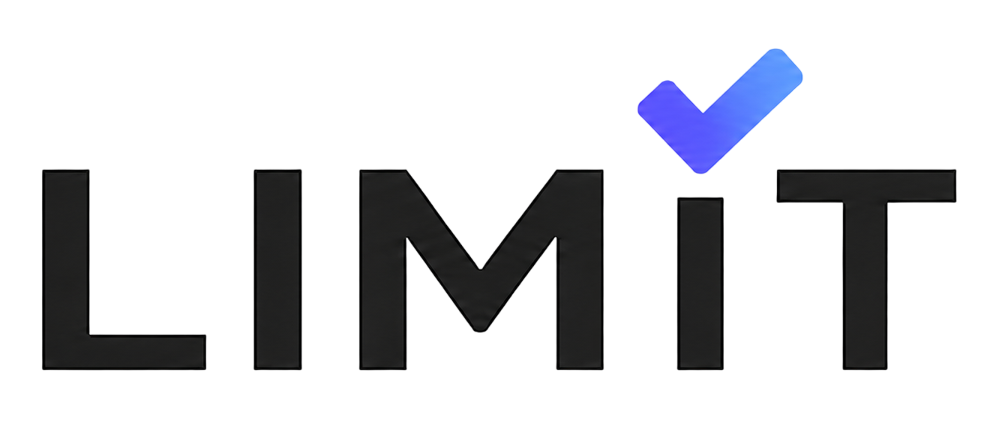
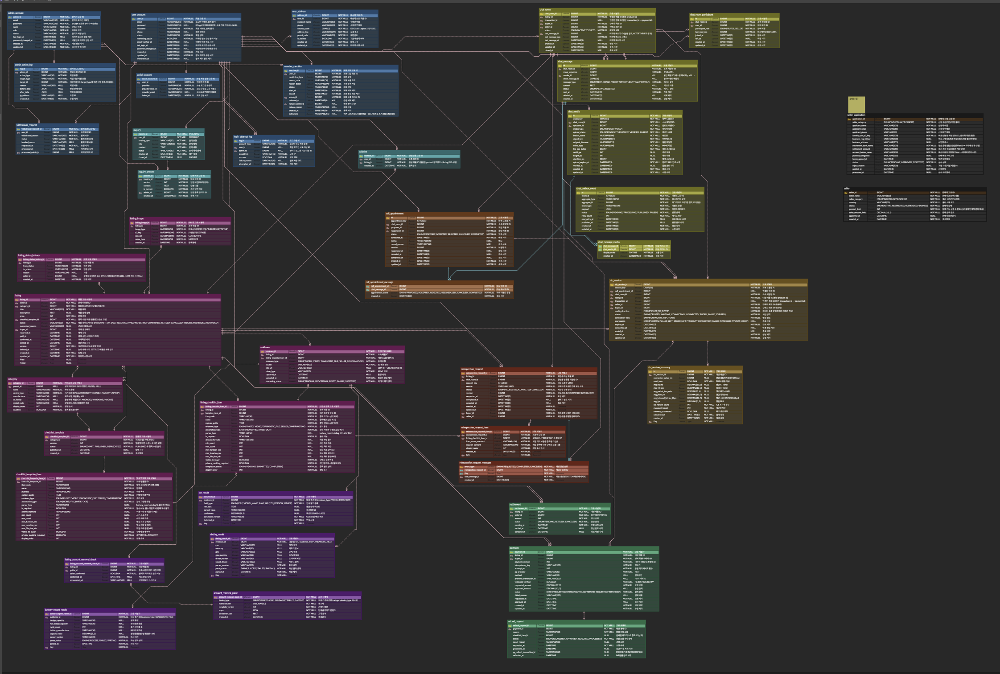
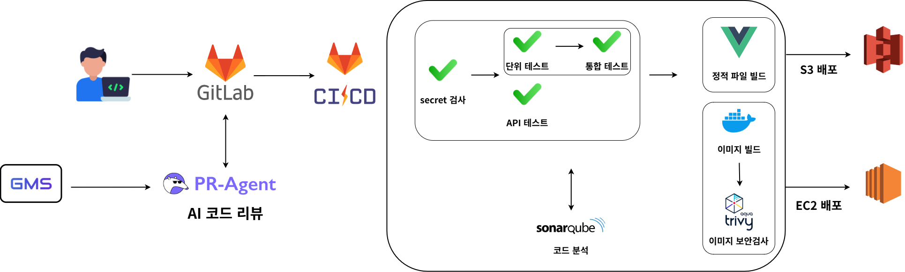

# 

[](https://l1mit.shop)
[](https://docs.l1mit.shop)
[](https://sonarcloud.io/summary/overall?id=limit)
[](https://sonarcloud.io/summary/overall?id=limit)
[](https://sonarcloud.io/summary/overall?id=limit)

중고 전자기기를 살 때 가장 불안한 건 "이거 진짜 멀쩡한가"입니다. L1MIT은 그 확인을 거래 전에 끝내는 중고 거래 서비스입니다.

- **판매자**는 기기를 등록하면서 상태 체크리스트를 하나씩 통과하고, 항목마다 사진·영상 증거를 남깁니다.
- **구매자**는 그 검수 결과를 보고, 필요하면 판매자와 영상통화로 기기를 직접 확인한 뒤 결제합니다.
- **결제 대금**은 구매자가 물건을 받고 확정할 때까지 보관되며, 문제가 있으면 재검수와 환불로 이어집니다.


## 💻 Tech Stacks

| 구분 | 기술 |
| --- | --- |
| Backend | Java 21, Spring Boot 4.0.7, Spring Data JPA, Spring Data MongoDB, Spring Data Redis, Spring Security, Spring WebSocket, Flyway, springdoc-openapi 3.0.3, AWS SDK for Java v2 (S3) |
| Frontend | Vue 3.4, Vite 7, Vue Router 4, Tailwind CSS 3.4, Chart.js, ffmpeg.wasm, Sentry |
| Desktop Scanner | .NET 8 (SDK 8.0.415), WinForms, `dxdiag`·`powercfg` 기반 무설치 단일 실행 파일 |
| Data | MySQL 8.4, MongoDB 8.0, Redis 7.4 |
| Media / RTC | S3 presigned upload, CloudFront, coturn(TURN), WebSocket 시그널링 |
| Infrastructure | 단일 EC2, Docker Compose, Nginx, Blue-Green, Terraform(dns·frontend·operations), Cloudflare |
| Observability | Prometheus 3.4, Loki 3.5, Grafana 12, Alertmanager, Grafana Alloy, node-exporter, cAdvisor, mysqld/mongodb/redis/nginx exporter |
| CI/CD | GitLab CI, Spotless, JaCoCo, SonarQube, OWASP Dependency-Check, Trivy 컨테이너 스캔, Secret 스캔 |
| Test | JUnit 5, Spring Boot Test, Testcontainers 2.0.5, Vitest 3, Vue Test Utils, xUnit(Scanner) |

## 🏗️ System Architecture


도메인 경계는 애플리케이션 패키지로 분리하고 플랫폼 책임은 컨테이너로 넘긴 모듈러 모놀리식 구조입니다. 단일 EC2 위에서 Blue-Green 무중단 배포와 관측 스택을 함께 운영합니다.

### 1. 트래픽 제어 및 보안 (Traffic & Security)

- **Cloudflare & SSL**: 도메인(`l1mit.shop`) 연결과 HTTPS 보안 통신, CDN 캐싱, 비정상 트래픽 필터링을 담당합니다.
- **Nginx**: 리버스 프록시로 동작하며 Blue와 Green 중 현재 활성 슬롯으로 요청을 라우팅합니다.
- **Spring Security & JWT**: 모든 API의 인증·인가를 단일 필터 체인에서 검증합니다.
- **coturn**: 화상 검수의 영상·음성을 애플리케이션 서버를 거치지 않고 릴레이합니다.

### 2. 배포 및 운영 자동화 (Delivery & Operations)

- **GitLab CI**: `guard → test → quality → package → deploy → verify` 6단계로 검증과 배포를 조정합니다.
- **Blue-Green Deployment**: 유휴 색상을 먼저 띄우고 readiness와 스모크 테스트를 통과한 뒤에만 트래픽을 넘깁니다. 실패하면 기존 색상이 계속 요청을 처리합니다.
- **Docker Compose**: 애플리케이션·데이터·관측 컨테이너를 하나의 정의로 묶어 로컬과 운영에 같은 구성을 사용합니다.
- **Terraform**: DNS, 프론트 배포 버킷, 운영 리소스를 코드로 관리합니다.
- **Flyway**: DB 스키마 변경을 버전으로 남기고 애플리케이션 시작 시 실제 스키마와 대조합니다.

### 3. 도메인 레이어 (Domain Layer)

| Domain | Description |
| --- | --- |
| Product | 상품 등록·검색·찜·조회수, 기기 카탈로그 기반 모델·색상·용량 선택 |
| Inspection | AI 체크리스트 생성, 항목별 증거 업로드와 이력, dxdiag·배터리 리포트 파싱과 진단 값 확정, 상품 진단 요약, 재검수 요청 |
| RTC / Call | WebRTC 시그널링과 화상 검수 통화 기록 |
| Chat | WebSocket 기반 구매자–판매자 실시간 문의 |
| Payment / Refund / Settlement | 결제 승인·취소·재시도, PG 대사 복구, 환불, 판매자 정산 |
| Auth / Member / Seller | 소셜 로그인과 이메일 인증, 회원 정보, 판매자 전환 |
| Admin | 기기 모델 승인 요청 처리와 운영 도구 |

각 도메인은 `com.c203.limit.domain.<domain>` 아래에 자신의 `controller`, `service`, `entity`, `repository`, `dto`를 두고, 도메인끼리는 Entity를 직접 공유하지 않고 Service·ID·이벤트로 연결합니다. 공통 응답·예외·설정·보안·로깅은 `global`이 맡습니다.

### 4. 기기 진단 파이프라인 (Device Diagnostics)

검수 신뢰도를 사람의 진술이 아니라 기기가 내놓는 값으로 뒷받침하는 경로입니다.

- **Windows Scanner**: `windows-scanner/`의 .NET 8 WinForms 무설치 실행 파일이 `dxdiag.exe`·`powercfg.exe`를 돌려 진단 파일을 만들고, 웹에서 발급한 일회용 연결 코드로 검사 세션에 업로드합니다. 프론트 배포 산출물의 `/downloads/LimitScanner.exe`로 내려받습니다.
- **브라우저 실동작 점검**: `frontend/src/features/deviceCheck`에서 카메라·마이크·스피커·키보드·포인터를 브라우저 API로 직접 동작시켜 결과를 남깁니다. 실패 항목은 재시도할 수 있고 임시저장에도 결과가 보존됩니다.
- **진단 값 확정과 집계**: 업로드된 dxdiag·배터리 리포트와 실동작 결과를 항목별 진단 값으로 정규화하고, 판매자가 확정한 값만 상품 진단 요약에 반영합니다.
- **체크리스트 연계**: 기기 타입(스마트폰·노트북)별 체크리스트 항목에 진단 결과를 매핑해 자동 통과 항목과 수동 증거가 필요한 항목을 구분합니다.

상세 계약은 `docs/api/windows-auto-inspection.md`, `docs/api/device-checklist-generation.md`, `docs/api/laptop-checklist-generation.md`에 있습니다.

주요 설계 판단은 문서로 남깁니다. 상품 목록 조회의 N+1을 `@EntityGraph` + 일괄 집계로 해소해 쿼리 402회 → 4회로 줄인 기록은 `docs/api/product.md`에, 조회수 비동기 처리의 트레이드오프(유실 허용 범위와 후속 과제)는 `docs/adr/0005-product-view-count.md`에 있습니다.

### 5. 데이터 저장 및 외부 연동 (Persistence & Integration)

- **MySQL**: 상품·주문·회원처럼 정합성이 중요한 영속 데이터를 저장합니다.
- **MongoDB**: 채팅 메시지처럼 스키마가 유연해야 하는 데이터를 담당합니다.
- **Redis**: 리프레시 토큰, 이메일 인증 코드, 캐시를 처리합니다.
- **S3 & CloudFront**: presigned URL로 이미지·영상을 올리고 프론트 정적 산출물을 배포합니다.
- **외부 API**: AI 체크리스트 생성, CLOVA OCR, 결제 PG, SMTP 메일 발송을 연동합니다.

### 6. 관측 및 알림 (Observability)

- **Prometheus**: 애플리케이션·호스트·컨테이너·DB 메트릭을 주기적으로 수집합니다.
- **Loki & Alloy**: 컨테이너 표준 출력 로그를 모아 저장하고 질의할 수 있게 합니다.
- **Grafana**: 메트릭과 로그를 한 화면에서 조회하는 대시보드를 제공합니다.
- **Alertmanager**: 임계치를 넘으면 담당자에게 메일로 알립니다.
- **Sentry**: 브라우저에서 발생한 프론트엔드 오류를 수집합니다.

## 🗂️ ERD



상품·검수·거래·결제를 잇는 핵심 테이블 관계입니다. 스키마 변경 이력은 `backend/src/main/resources/db/migration`의 Flyway 마이그레이션에 남습니다.

## 🚀 CI/CD Pipeline



> 코드 품질 유지와 무중단 배포를 위해 **AI 코드 리뷰**, **정적 분석**, **취약점 스캔**이 포함된 `guard → test → quality → package → deploy → verify` 6단계 자동화 파이프라인을 운영합니다.

### 1. 지속적 통합 (Continuous Integration)

- **Secret Guard**: 커밋에 토큰·키·인증서가 섞여 있으면 이후 단계를 실행하지 않고 즉시 차단.
- **Change Detection**: `backend/**`, `frontend/**`, `infra/**` 변경 경로를 계산해 필요한 잡만 실행하여 파이프라인 시간 단축.
- **Backend Test**: `test`(단위) → `integrationTest`(Testcontainers로 실제 MySQL·MongoDB 기동) → `infrastructureTest`(외부 엔진 스모크) 세 단계로 분리. 통합 테스트는 `core`/`support` 두 shard로 나눠 병렬 실행.
- **Frontend Lint & Build**: ESLint, Vitest, 프로덕션 빌드까지 확인.
- **Windows Scanner Build**: `windows-scanner/**` 변경 시 .NET 8 SDK 이미지에서 win-x64 단일 실행 파일을 publish하고, 산출물을 프론트 빌드의 `public/downloads/LimitScanner.exe`로 넘겨 같은 배포에 실어 보냄. 스피커 톤 생성·전원 상태 추적·모듈 결과 판정은 `windows-scanner/tests`에서 단위 검증.
- **Script Regression**: 파이프라인 로직을 YAML이 아닌 `scripts/`의 셸 스크립트에 두고, `rollback-blue-green.test.sh`·`sync-deploy-files.test.sh` 등 `*.test.sh`로 스크립트 자체를 회귀 검증.

### 2. 코드 품질 검증 (Code Quality)

- **PR-Agent (AI Review)**: MR diff를 AI가 분석해 자동 코드 리뷰 코멘트를 남기고 품질을 사전 점검.
- **SonarQube (Static Analysis)**: 버그, 취약점, 코드 스멜 탐지를 통한 기술 부채 최소화. Quality Gate 결과는 상단 뱃지에서 바로 확인할 수 있습니다.
- **JaCoCo**: 테스트 커버리지 측정과 리포트 게시.
- **OWASP Dependency-Check**: 의존성 CVE 점검, CVSS 7.0 이상이면 빌드 실패.
- **OpenAPI Contract**: API 스펙과 실제 컨트롤러 계약의 불일치 검사.

### 3. 이미지 빌드 및 스캔 (Package)

- **Image Build**: 백엔드 컨테이너 이미지를 빌드해 registry에 푸시.
- **Trivy Container Scan**: HIGH·CRITICAL 취약점이 발견되면 배포 전 파이프라인 중단.
- **Immutable Digest**: 태그가 아닌 digest로 고정해 배포 버전 추적성과 롤백 근거 확보.

### 4. 배포 및 검증 (Deploy & Verification)

- **Blue-Green Deployment**: 유휴 색상에 새 버전을 먼저 띄우고 readiness를 확인.
- **Health Check & Smoke Test**: 배포 직후 서비스 상태를 확인해 통과한 경우에만 Nginx upstream을 전환.
- **Auto Rollback**: 실패 시 기존 색상을 그대로 유지하거나 이전 digest로 복구.
- **Frontend Deploy**: S3 동기화와 CloudFront 캐시 무효화를 수행하고, 실패하면 롤백 잡으로 되돌림.
- **Recovery Drill**: 백업 복구와 알림 발송 경로는 `scripts/restore-backup-drill.sh`, `scripts/test-alertmanager-notification.sh`로 실제 복구·발송까지 확인.

실행할 수 없는 검증은 성공으로 간주하지 않고, 사유와 남은 위험을 MR에 함께 보고합니다.

## ✨ 주요 기능 (Key Features)

> 각 칸의 `` 주석을 해제하고 `docs/images/`에 같은 이름의 이미지를 넣으면 화면이 표시됩니다.

<table>
  <tr>
    <td width="50%" valign="top">
      <!--  -->
      <h3>회원·인증</h3>
      이메일 가입과 인증 메일 발송, Google·Kakao·NAVER 소셜 로그인, JWT 재발급, 구매자에서 판매자로의 전환을 지원합니다.
    </td>
    <td width="50%" valign="top">
      <!--  -->
      <h3>상품 등록과 탐색</h3>
      4단계 임시저장 등록, 기기 카탈로그 기반 모델·색상·용량 선택, 이미지와 영상의 presigned 업로드, 조건 검색과 정렬, 찜, 조회수를 제공합니다.
    </td>
  </tr>
  <tr>
    <td width="50%" valign="top">
      <!--  -->
      <h3>검수</h3>
      기기와 노트북별 AI 체크리스트를 자동 생성하고, 항목마다 증거 자료를 업로드해 이력으로 남깁니다. 필수 항목 검증과 재검수 요청 흐름을 포함합니다.
    </td>
    <td width="50%" valign="top">
      <!--  -->
      <h3>기기 실동작 점검</h3>
      브라우저에서 카메라·마이크·스피커·키보드·포인터를 직접 동작시켜 통과 여부를 판정합니다. 실패 항목은 재시도할 수 있고 임시저장에도 결과가 남습니다.
    </td>
  </tr>
  <tr>
    <td width="50%" valign="top">
      <!--  -->
      <h3>Windows 자동 진단</h3>
      무설치 실행 파일이 <code>dxdiag</code>·<code>powercfg</code> 결과를 수집해 일회용 연결 코드로 업로드하고, 사양·배터리 수치가 체크리스트 항목에 자동 반영됩니다.
    </td>
    <td width="50%" valign="top">
      <!--  -->
      <h3>화상 검수</h3>
      WebRTC 기반 실시간 통화로 구매자가 기기 상태를 직접 확인합니다. TURN 릴레이와 통화 기록을 지원합니다.
    </td>
  </tr>
  <tr>
    <td width="50%" valign="top">
      <!--  -->
      <h3>채팅</h3>
      구매자와 판매자 사이의 실시간 문의를 WebSocket으로 주고받고 메시지는 MongoDB에 저장합니다.
    </td>
    <td width="50%" valign="top">
      <!--  -->
      <h3>거래 상태 관리</h3>
      <code>DRAFT → ON_SALE → RESERVED → PAID → INSPECTING → CONFIRMED</code> 상태 전이를 이력과 함께 기록하고, 예약 만료와 자동 구매확정을 스케줄러로 처리합니다.
    </td>
  </tr>
  <tr>
    <td width="50%" valign="top">
      <!--  -->
      <h3>결제·정산</h3>
      결제 승인·취소·재시도, PG 대사 기반 복구, 환불, 판매자 정산을 처리합니다.
    </td>
    <td width="50%" valign="top">
      <!--  -->
      <h3>운영·관리자</h3>
      관리자 콘솔에서 기기 모델 승인 요청을 처리하고, 알림 메일 발송과 백업·복구 드릴을 운영합니다.
    </td>
  </tr>
</table>

## 🛠️ Local Development

Docker Desktop만 켜져 있으면 스크립트 한 줄로 실행됩니다. 환경 파일 생성, 컨테이너 기동, Swagger·Grafana 열기까지 스크립트가 처리합니다.

```powershell
.\scripts\open-platform-tools.ps1     # 백엔드 + MySQL·MongoDB·Redis + 모니터링
cd frontend; npm ci; npm run dev      # 프론트
```

| 대상 | 로컬 | 운영 |
| --- | --- | --- |
| 프론트 | `http://localhost:5173` | <https://l1mit.shop> |
| Swagger | `http://localhost:18080/swagger-ui.html` | <https://docs.l1mit.shop> |
| Grafana | `http://localhost:3000` | <https://grafana.l1mit.shop> |
| SonarQube | — | <https://sonarcloud.io/summary/overall?id=limit> |

종료는 `docker compose -p limit-local down`입니다.

Windows 진단 앱은 별도로 실행합니다.

```powershell
$env:LIMIT_API_BASE_URL='http://localhost:18080/'
dotnet run --project .\windows-scanner\src\LimitScanner\LimitScanner.csproj
```

### 검증

```powershell
cd frontend; npm run lint; npm run test; npm run build
cd backend;  .\gradlew.bat test; .\gradlew.bat integrationTest; .\gradlew.bat bootJar
cd windows-scanner; dotnet test
```

## 📁 Repository Structure

```
limit/
├── backend/                    Spring Boot 애플리케이션
│   └── src/
│       ├── main/java/com/c203/limit/
│       │   ├── domain/         admin, auth, call, chat, inspection, member,
│       │   │                   payment, product, refund, rtc, seller, settlement
│       │   └── global/         api, bootstrap, common, config, exception,
│       │                       logging, response, security
│       ├── main/resources/db/migration/   Flyway 마이그레이션
│       ├── test/               단위·슬라이스 테스트
│       └── integrationTest/    Testcontainers 통합 테스트 (integrationTest·infrastructureTest 태스크가 공유)
├── frontend/                   Vue 3 스토어프론트
│   └── src/                    api, assets, auth, components, composables, features,
│                               layouts, legal, mock, monitoring, pages, router,
│                               stores, styles, utils
├── windows-scanner/            .NET 8 WinForms 진단 앱
│   ├── src/LimitScanner/       dxdiag·powercfg 수집과 업로드
│   └── tests/                  스캐너 단위 테스트
├── infra/
│   ├── compose.yml             공통 데이터 계층
│   ├── compose.local.yml       로컬 오버레이
│   ├── compose.prod.yml        Blue/Green, coturn, 모니터링 스택
│   ├── nginx/                  리버스 프록시와 Blue-Green upstream
│   ├── monitoring/             Prometheus, Loki, Grafana, Alertmanager, Alloy 설정
│   ├── admin/                  admin.l1mit.shop 정적 관리자 콘솔
│   ├── aws/                    S3 미디어 버킷 정책·CORS 설정
│   ├── secrets/                시크릿 템플릿(`*.example`), 실제 값은 서버에만 존재
│   ├── state/                  백업·exporter 런타임 상태 (배포 시 동기화 제외)
│   └── terraform/              dns, frontend, operations
├── scripts/                    빌드·배포·롤백·백업·점검 스크립트와 그 테스트
├── docs/
│   ├── api/                    API 계약과 OpenAPI
│   ├── adr/                    아키텍처 결정 기록
│   ├── db/                     스키마
│   ├── images/                 README용 스크린샷·다이어그램
│   ├── integration/            외부 연동·데이터 Runbook
│   ├── legal/                  약관·개인정보 근거
│   ├── product-redesign/       상품 도메인 재설계 산출물
│   └── runbook/                운영 절차
├── .gitlab/                    PR-Agent 등 하위 파이프라인 정의
├── .githooks/                  커밋 컨벤션·시크릿 검사 훅
├── compose.yaml                로컬 진입점 (infra/compose.yml + compose.local.yml include)
└── .gitlab-ci.yml              6단계 파이프라인
```
